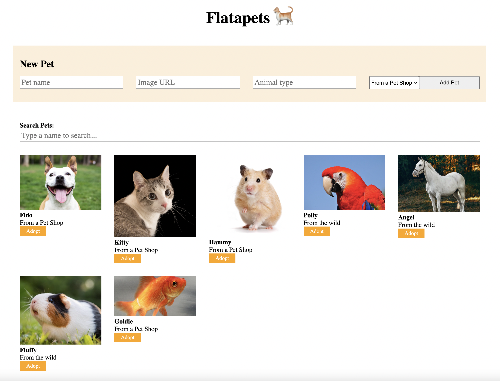

# Flatapets Lab

## Demo Image

Use this image as an example of how the app should look.



## Instructions

Welcome to Flatapets! You've been tasked with building out some features for the admin side of a pet adoption website that is dedicated to helping pets find new homes. The designers have put together the components and CSS. Now it's up to you to bring the features to life by adding stateful logic as well as persisting data to the backend via our API.

Your job will be to make our app work according to the user stories you will
find in the [Core Deliverables](#Core-Deliverables) section.

## Setup

1. Run `npm install` in your terminal.
2. Run `npm run server`. This will run your backend on port `4000`.
3. In a new terminal, run `npm start`. This will run your React app on port `5000`.

In our React application, the data about the Pets is in the `db.json` file. This file will mimic an API that follows RESTful conventions.

Make sure to open [http://localhost:4000/pets](http://localhost:4000/pets) in the browser to verify that your backend is working before you proceed!

## Base URL

The base URL for your backend is: `http://localhost:4000`

## What You Already Have

The `App` component holds two children: `Header` and `PetPage`. The `PetPage` component holds three children: `NewPetForm`, `Search` and `PetList`. These components have some starter code in them already. The `PetList` component will render all `Pet` components.

All of the code to style the page has been written for you, meaning that you should be adding to the code rather than editing it.

## Core Deliverables

As a user:

1. When the app starts, I can see a list of pets on the page, where each pet is rendered using a `Pet` component. Each of the `Pet` components should display a pet's image, name, and conditionally render whether the pet is from a pet shop or from the wild. If the pet is from a pet shop, the component should say "From a Pet Shop", otherwise it should say "From the wild".

2. I can click on the image of the pet in the `Pet` component and see the animal_type in place of the name. If I click on the image again, the animal_type should again be replaced with the name. If I click on another pet's image, it toggles that pet's name independent of any other pet's.

3. I can add a new pet to the page by submitting the form in the `NewPetForm` component. This should add the new pet in your React app by updating the appropriate state and should additionally persist the added pet to the JSON Server database.

4. I can type in the input field (search bar) in the `Search` component and see a filtered list of pets whose name or animal_type match the text in the input field. If there's no text in the input field, all the pets should be rendered.

### Endpoints for Core Deliverables

#### GET `/pets`

Example Response:

```json
[
  {
    "id": 1,
    "name": "Fido",
    "fromPetShop": true,
    "image": "./images/dog.jpeg",
    "animal_type": "Dog"
  },
  {
    "id": 2,
    "name": "Kitty",
    "fromPetShop": true,
    "image": "./images/cat.png",
    "animal_type": "Cat"
  }
]
```

#### POST `/pets`

Required Headers:

```javascript
{
  "Content-Type": "application/json"
}
```

Request Object:

```json
{
  "name": "string",
  "fromPetShop": boolean,
  "image": "string",
  "animal_type": "string"
}
```

Example Response:

```json
{
  "id": 7,
  "name": "Goldie",
  "fromPetShop": true,
  "image": "./images/fish.jpeg",
  "animal_type": "Fish"
}
```

## Advanced Deliverables

If you have the extra time, these Advanced Deliverables are a great way to
stretch your skills.

You'll have to add additional elements for the features in Advanced Deliverable # 1. Feel free to style
them however you see fit!

> Note: If you are going to attempt these advanced deliverables, please be sure to have a working commit with all the Core Deliverables first!

As a user:

1. I can update the name of a pet and still see the updated name after refreshing the page.

2. I can delete a pet when clicking the "Adopt Pet" button and it is still gone when I refresh the page.

### Endpoints for Advanced Deliverables

#### PATCH /pets/:id

Required Headers:

```js
{
  "Content-Type": "application/json"
}
```

Request Object:

```json
{
  "name": "string"
}
```

Example Response:

```json
{
  "id": 1,
  "name": "Fido",
  "fromPetShop": true,
  "image": "./images/dog.jpeg",
  "animal_type": "Dog"
}
```

#### DELETE /pets/:id

Example Response:

```json
{}
```
